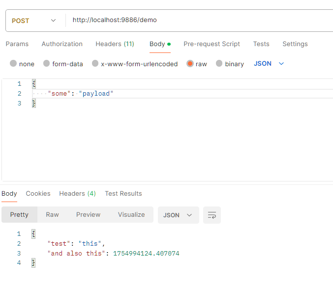
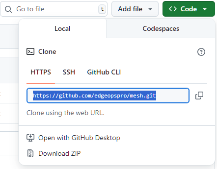

# EdgeOps Pro Mesh

A simplified & lightweight solution for managing and distributing computing tasks

## Mesh Versions

| Version | Branch | Details |
|:---:|:---:|:----|
| `v1a` | `@v/1a` / `main` | Bare version of mesh server for testing or extending without "fighting" the code base

## One Minute Setup

Before you begin, ensure yo've got python 3 installed on your machine (if not, just click [here](https://www.python.org/downloads/), download and install it)

* Copy files to your local machine
  * via git (use terminal to execute) - `git clone https://github.com/edgeopspro/mesh.git`
  * manual download:
    * from github interface - click the `Code` button and select `Download ZIP`
    * extract downloaded file content into a folder (aka workdir)
* Open terminal and enter your workdir
* Run `python http.srv.py` to run mesh server (using simple `http` service)
* Open another terminal window
* Enter your workdir and run `python op.simple.py` for a simple API demonstration
* Go Wild and open another terminal window
* Run `python op.proxy.py` from your workdir to also host a simple website
* From your browser:
  * navigate to `http://localhost:9886/app`
  * observe the most basic website in existence (credit to [VITE](https://vite.dev/guide/))
* From your API management solution:
  * `POST` something to `http://localhost:9886/demo`
  * try to contain yourself while getting the AMAZING payload the service spit back at you

And just because we all know that one minute is already too much work - here's how it all ends:




For the ones who actually trying to perform - if you got trouble downloading the code, here's a nice visual to help you keep going:



The real magic is  all the logs output you are going to get from this experiment... but - no way I'm sharing these screenshots - you need to test it to see it 🙃

## Motivation

Saying that monoliths are bad and microservices are gr8, is nice and all but - easier said than done. If you actually try to develop in microservices there are SO MUCH thing to take in considerations (or else, your DevOps team will give you hard time or your company will get bankrupt for over paying managed cloud-base services).
Many solutions exists out there, many of them using too much resources and are very problematic to extend. This project is an over-simplification of an infrastucture that allows you to deploy your tasks using operators while extending to your needs without fighting a "fallback" behavior that is baked deep-in the code. It just you and your business needs on a blank canvas. For free

## Highlights

* No 3rd-party libraries (at all, everything is controlleable)
* Exposed code (no internal libraries used) - with a shared space (inside `lib` folder) for yout to modify and extend as you pleased
* Performant - blazingly fast and easy to extend
* Free! This basic version is forever free, prices will only apply for tailor made extensions for our business partners
* MIT-0 license - so you don`t have to copy the original copyright attached here to your work (we are not savages after all)

## Technical Bits

Well... fun part is over. From here and on, it's only getting over detailed for the poor souls who actually trying to figure out what's going on. Read at your own risk

### Core Principels

* Mesh Server (aka `srv`) - a server component to control ang manage operators (aka, `ops`)
* Mesh Operator (aka `op`) - a working unit fore executing tasks (it will run in background and wait for tasks to execute)
* Mesh Config - a configuration file that holds relevant information for proper run (can be applied to mesh server or operator - `srv` / `op`)
* Mesh Router - a configuration file that specify how the mesh server route traffic to operators (this mechanism heavily rely on tags)
* Mesh Tags - use to identify operators while routing traffic from server (every operator can have multiple tags)
* Mesh Transporter - a transport method to communicate between mesh operators and server

### Mesh Operator - In Depth

Every operator uses a single transport method in order to be activated and may use other transporters for further communications. Let's take `op.simple.py` as a reference:

```python
http(                       # from "op.run.py" file - use the "http" transport method
  [ start, stop ],          # hooks, used to communicate as part of the lifecycle of the operator
  [                         # middlewares - a sequence of actions to be executed when this operator is requested
    mid_json_in,            # "json in" middleware - before processing the request itself, parse the payload to object (JSON format)
    proc_http,              # process the request
    mid_json_out            # "json out" middleware - before returning a response, convert the payload from object to string (JSON format)
  ],
  'op.simple.config.json'   # take the rest of the applicative configuration from this file
)
```

Notice that although the operator uses `http` transport method, the actual communication between the operator and the server is executed by the `tcp` transporter (additional extensions with other transportes may be added, if requested).

Also, since the actual action here is performed by `proc_http` (just a name that describes the function that processing the http request, not a reserved keyword or something), this code contains the processing performed by this operator

```python
def proc_http(ctx, state):                  # ctx is the context with useful functions to use, while state object is the state of current request (used by middlewares)
  ctx.log('process incoming http payload')
  payload, heads, info = state              # get the actual data, related for the request
  origin = info['origin']
  path = info['path']
  ctx.log(f'received payload {payload} of type: {type(payload)} from origin {origin} (with path {path})')

  return {                                  # return a payload - if you need to return other data (like headers), use the proxy example as reference
    'test': 'this', 
    'and also this': time()
  }
```

### Mesh Router - In Depth

Let's take the `http.router.json` file as a reference:

```json
{
  "http": {         <------  a section dedicated to http transport (other transportrs method may be added)
    "/app": [       <------  routing entry "app" ("app" is also used in the routing of the web application as a prefix)
      [],           <------  pre process operators - receive the data to selected operators *before* processing operators
      [ "proxy" ],  <------  process operators - a list of operators for processing "app" entry request
      []            <------  post process operators - receive the processed data to selected operators *after* processing operators completed
    ],
    "/demo": [      <------  routing entry "demo" ("demo" is just a name - not a keyword, you can use any other names instead)
      [],           <------  pre process operators - none selected
      [ "test" ],   <------  process operators - only one processor selected with tag "test"
      []            <------  post process operators - none selected
    ]
  }
}
```

**In Short:** the reason why the `/app` route navigates to w web application is because of `proxy` tag. Note that `op.proxy.config` file uses the following configuration

```json
{
  "mesh": {
    "op": {
      "tags": [ "http", "proxy", "test" ]  <------  the tag "proxy" is requested by the router, therefore this operator is activated for "app" entry
    },
    "srv": "127.0.0.1:9886"
  },
  ...
}
```

**The Full Story:** 
* Create a different operator with the tag "proxy" - and the data will be send to both operators
* This behavior is better be use in `pre` and `post` process operators (to avoid unexcpected behavior)
* Also, `pre` and `post` process operators action mode is `fnf` (fire and forget), while process operator mode is `snr` (send and receive) - which is sequntial
* The router accepts multiple processors for each entry for each type (`pre`, `proc` and `post`) - that's why arrays are used even for a single item or no items

## Final Thoughts

So.. you manage to survive this `README` file... or you just scrolled down to see how the end looks like. Noice! 

Anyhow - done something interesting with `mesh` or aving some thoughts / feedbacks? Send and email and share your experience with us 😎